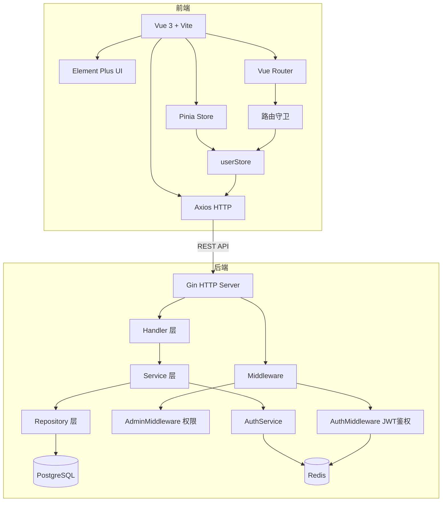
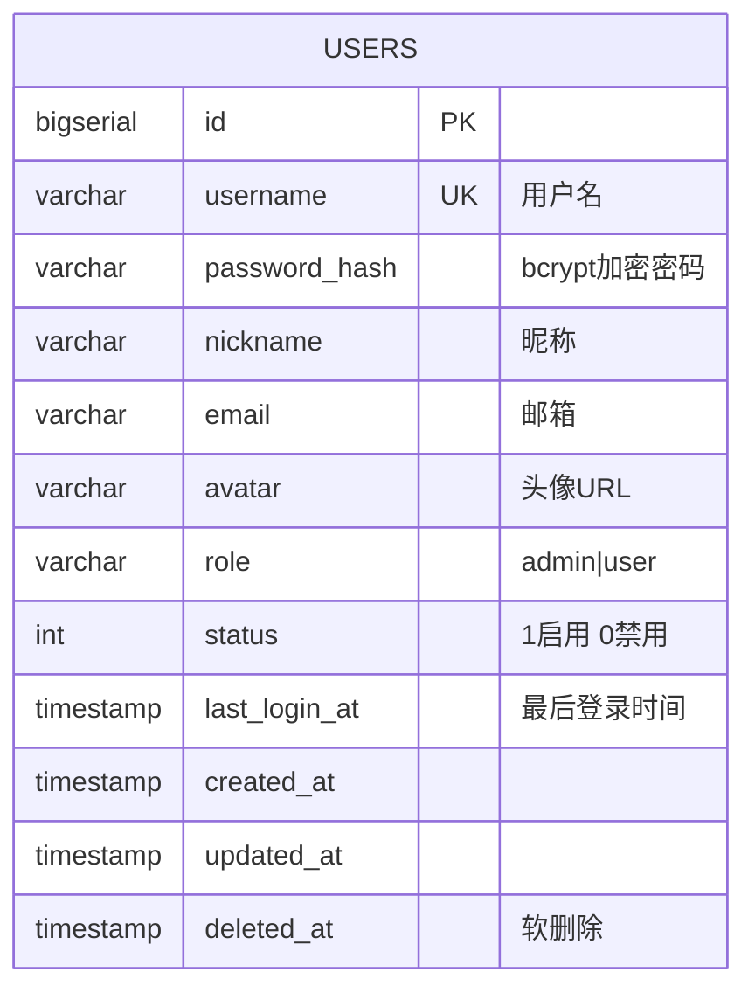
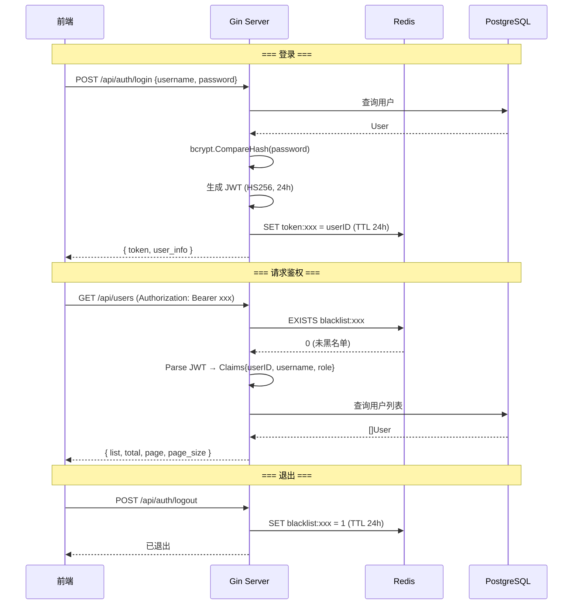
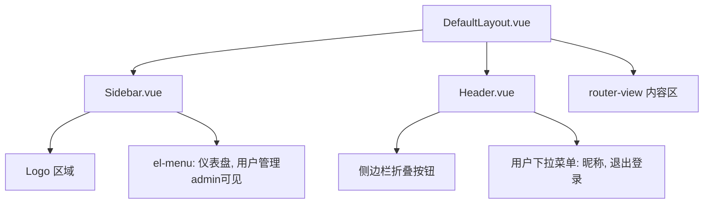

# Cybertron Portal 技术方案文档

> 最后同步: 2026-06-09

## 1. 架构总览



## 2. 后端设计

### 2.1 服务入口

`backend/cmd/server/main.go`

- 加载 `config/config.yaml` 配置
- 连接 PostgreSQL（GORM AutoMigrate 自动建表）
- 连接 Redis
- 初始化 Repository → Service → Handler 依赖链
- 注册路由并启动 HTTP 服务（端口 8080）

### 2.2 配置管理

`backend/internal/config/config.go` + `backend/config/config.yaml`

```yaml
server:
  port: 8080
database:
  host: 192.168.101.1
  port: 5432
  user: postgres
  password: "123456"
  dbname: cybertron
redis:
  addr: 192.168.101.1:6379
  password: ""
jwt:
  secret: cybertron-jwt-secret-key-2026
  expire_hours: 24
```

### 2.3 数据模型

`backend/internal/model/user.go`

**UserRepositoryInterface** (`backend/internal/repository/user.go:9`):

```go
type UserRepositoryInterface interface {
    Create(user *User) error
    FindByID(id uint) (*User, error)
    FindByUsername(username string) (*User, error)
    FindAll(page, pageSize int) ([]User, int64, error)
    Update(user *User) error
    Delete(id uint) error
    UpdateLastLogin(id uint) error
}
```

数据库表结构：



| 字段 | 类型 | 约束 | 说明 |
|------|------|------|------|
| id | BIGSERIAL | PK | 主键自增 |
| username | VARCHAR(64) | UNIQUE, NOT NULL | 用户名 |
| password_hash | VARCHAR(256) | NOT NULL | bcrypt 加密 |
| nickname | VARCHAR(64) | | 昵称 |
| email | VARCHAR(128) | | 邮箱 |
| avatar | VARCHAR(256) | | 头像 URL |
| role | VARCHAR(32) | DEFAULT 'user' | admin / user |
| status | INT | DEFAULT 1 | 1启用 0禁用 |
| last_login_at | TIMESTAMP | | 最后登录 |
| created_at | TIMESTAMP | | 创建时间 |
| updated_at | TIMESTAMP | | 更新时间 |
| deleted_at | TIMESTAMP | INDEX | 软删除 |

### 2.4 API 接口

`backend/internal/handler/auth.go` + `backend/internal/handler/user.go`

Handler 层通过接口依赖服务层，便于单元测试：
- `AuthHandler` 依赖 `service.AuthServiceInterface`
- `UserHandler` 依赖 `service.UserServiceInterface`

| 方法 | 路径 | 鉴权 | 说明 |
|------|------|------|------|
| POST | `/api/auth/login` | 否 | 登录，返回 JWT token + 用户信息 |
| POST | `/api/auth/logout` | JWT | 退出，Redis 黑名单 token |
| GET | `/api/user/me` | JWT | 获取当前登录用户信息 |
| GET | `/api/users` | JWT+Admin | 用户列表（分页） |
| POST | `/api/users` | JWT+Admin | 创建用户 |
| PUT | `/api/users/:id` | JWT+Admin | 更新用户 |
| DELETE | `/api/users/:id` | JWT+Admin | 删除用户（软删除） |

**统一响应格式：**

```json
{ "code": 0, "message": "success", "data": {} }
```

### 2.5 业务逻辑层

`backend/internal/service/auth.go` + `backend/internal/service/user.go`

**AuthServiceInterface** (`auth.go:25`):

```go
type AuthServiceInterface interface {
    Login(ctx context.Context, username, password string) (*LoginResult, error)
    Logout(ctx context.Context, token string) error
    ValidateToken(ctx context.Context, tokenString string) (*Claims, error)
    GetUserByID(id uint) (*User, error)
}
```

**UserServiceInterface** (`user.go:12`):

```go
type UserServiceInterface interface {
    GetByID(id uint) (*User, error)
    FindAll(page, pageSize int) ([]User, int64, error)
    Create(req *CreateUserRequest) (*User, error)
    Update(id uint, req *UpdateUserRequest) (*User, error)
    Delete(id uint) error
}
```

**AuthService：**
- `Login(username, password)` → bcrypt 验证 → 生成 JWT → Redis 缓存 token → 返回 token + 用户信息
- `Logout(token)` → Redis 黑名单 token（TTL 对齐 JWT 过期时间）
- `ValidateToken(token)` → 检查黑名单 → 解析 JWT

**UserService：**
- `Create` → 用户名+密码 → bcrypt hash → 写入 DB
- `Update` → 部分字段更新（密码可选）
- `Delete` → GORM 软删除
- `FindAll` → 分页查询（默认 page=1, page_size=10）

### 2.6 中间件

`backend/internal/middleware/auth.go` + `backend/internal/middleware/cors.go`

| 中间件 | 说明 |
|--------|------|
| CORSMiddleware | 允许跨域（*），OPTIONS 预检返回 204 |
| AuthMiddleware | 提取 Bearer Token → 校验黑名单 → 解析 JWT → 注入 userID/username/role 到 Context |
| AdminMiddleware | 检查 Context 中 role == "admin"，否则返回 403 |

### 2.7 路由注册

`backend/internal/router/router.go`

```
/api
├── /auth
│   ├── POST /login          (公开)
│   └── POST /logout         (JWT)
├── /user
│   └── GET /me              (JWT)
└── /users
    ├── GET /                (JWT + Admin)
    ├── POST /               (JWT + Admin)
    ├── PUT /:id             (JWT + Admin)
    └── DELETE /:id          (JWT + Admin)
```

### 2.8 鉴权流程



### 2.9 单元测试

| 测试文件 | 用例数 | 覆盖内容 |
|----------|--------|----------|
| `pkg/jwt/jwt_test.go` | 7 | 生成/解析 Token、过期检测、无效密钥、多用户区分 |
| `pkg/response/response_test.go` | 5 | Success/Error/Page 响应格式、空数据 |
| `internal/service/auth_test.go` | 6 | 登录(成功/密码错/用户不存在/禁用)、退出、Token校验 |
| `internal/service/user_test.go` | 11 | 创建/默认角色/更新/改密/删除/查询/分页/参数边界 |
| `internal/middleware/auth_test.go` | 8 | Token缺失/有效、Admin授权/拒绝、CORS跨域预检 |
| `internal/handler/auth_test.go` | 5 | 登录成功/失败/空请求、退出(有无Token) |
| `internal/handler/user_test.go` | 8 | 当前用户/不存在、列表/分页、创建/更新/删除/无效ID |

**共计 50 个测试用例**，5 个包有测试覆盖：

```
ok  internal/handler      (13 tests)
ok  internal/middleware    (8 tests)
ok  internal/service       (17 tests)
ok  pkg/jwt               (7 tests)
ok  pkg/response           (5 tests)
```

**测试依赖库：**
- `github.com/stretchr/testify` — 断言框架
- `github.com/alicebob/miniredis/v2` — Redis 模拟
- `github.com/DATA-DOG/go-sqlmock` — SQL 模拟

## 3. 前端设计

### 3.1 路由设计

`frontend/src/router/index.ts`

| 路径 | 名称 | 组件 | 鉴权 | 权限 | 说明 |
|------|------|------|------|------|------|
| `/` | - | DefaultLayout | requiresAuth | - | 重定向到 /dashboard |
| `/dashboard` | Dashboard | views/dashboard/Index.vue | requiresAuth | - | 仪表盘 |
| `/users` | Users | views/user/Index.vue | requiresAuth | Admin | 用户管理 |
| `/login` | Login | views/login/Index.vue | 公开 | - | 登录页 |
| `/:pathMatch(.*)*` | NotFound | views/error/404.vue | 公开 | - | 404 |

**路由守卫 (beforeEach)：**
- 已登录访问 `/login` → 跳转 `/dashboard`
- 未登录访问需鉴权路由 → 跳转 `/login`

### 3.2 页面清单

| 页面 | 路径 | 功能 |
|------|------|------|
| 仪表盘 | `/dashboard` | 系统概览、欢迎页 |
| 登录页 | `/login` | 用户名/密码登录表单，含表单验证 |
| 用户管理 | `/users` | 用户列表（分页表格）+ 创建/编辑/删除 |
| 404 | `*` | 页面不存在提示 |

### 3.3 布局组件



**DefaultLayout** — `el-container`/`el-aside`/`el-header`/`el-main` 布局，侧边栏 200px/64px，顶栏 60px  
**Sidebar** — Logo "Cybertron"，深色主题 `#304156`，admin 角色可见"用户管理"菜单  
**Header** — 左侧折叠按钮，右侧用户头像+昵称下拉退出

### 3.4 公共组件

`frontend/src/components/` — 无公共组件。

`frontend/src/views/user/UserDialog.vue` — 用户创建/编辑弹窗组件。

| Props | 说明 |
|-------|------|
| visible | 弹窗是否可见 |
| mode | 'create' / 'edit' |
| user | 编辑时传入的用户对象 |

| Emits | 说明 |
|-------|------|
| update:visible | 关闭弹窗 |
| confirm | 提交表单数据 |

### 3.5 状态管理

**useAppStore** (`frontend/src/stores/app.ts`)

| State | 类型 | 默认值 | 说明 |
|-------|------|--------|------|
| sidebarCollapsed | boolean | false | 侧边栏折叠 |
| theme | 'light' \| 'dark' | 'light' | 主题 |

| Action | 说明 |
|--------|------|
| toggleSidebar() | 切换折叠 |

---

**useUserStore** (`frontend/src/stores/user.ts`)

| State | 类型 | 默认值 | 说明 |
|-------|------|--------|------|
| token | string | localStorage | JWT Token |
| userInfo | UserInfo \| null | null | 用户信息 |

| Getter | 说明 |
|--------|------|
| isLoggedIn | !!token |
| username | userInfo?.username |
| isAdmin | role === 'admin' |

| Action | 说明 |
|--------|------|
| login(username, password) | 调用 API → 存储 token + userInfo |
| fetchUserInfo() | GET /user/me，失败则 logout |
| logout() | 调用 API → 清空 token + userInfo |

### 3.6 API 调用层

`frontend/src/api/`

| 文件 | 导出函数 |
|------|----------|
| `request.ts` | Axios 实例（baseURL `/api`, timeout 10s，自动注入 token，401 跳转登录） |
| `auth.ts` | login(params), logout() |
| `user.ts` | getCurrentUser(), getUserList(), createUser(), updateUser(), deleteUser() |

### 3.7 类型定义

`frontend/src/types/api.d.ts`

```typescript
interface ApiResponse<T = unknown> { code: number; message: string; data: T }
interface PageResult<T> { list: T[]; total: number; page: number; pageSize: number }
```

## 4. 构建配置

### 4.1 Vite 配置

| 配置项 | 值 | 说明 |
|--------|-----|------|
| 开发服务器 | 0.0.0.0:3000 | 允许外部访问 |
| API 代理 | /api → http://localhost:8080 | 开发环境代理 |
| 路径别名 | @ → src/ | TypeScript 路径映射 |

### 4.2 Go 依赖

| 包 | 用途 |
|---|------|
| github.com/gin-gonic/gin | HTTP 框架 |
| gorm.io/gorm + driver/postgres | ORM + PostgreSQL 驱动 |
| github.com/redis/go-redis/v9 | Redis 客户端 |
| github.com/golang-jwt/jwt/v5 | JWT 签发与解析 |
| golang.org/x/crypto | bcrypt 密码加密 |
| github.com/spf13/viper | YAML 配置管理 |
| go.uber.org/zap | 结构化日志 |
| github.com/stretchr/testify | 单元测试断言（dev） |
| github.com/alicebob/miniredis/v2 | Redis 模拟（dev） |

### 4.3 前端依赖

| 包 | 版本 | 类别 |
|---|------|------|
| vue | ^3.5.34 | 核心框架 |
| vue-router | ^4.6.4 | 路由 |
| pinia | ^3.0.4 | 状态管理 |
| element-plus | ^2.14.1 | UI 组件库 |
| axios | ^1.17.0 | HTTP 客户端 |

## 5. 部署方案

### 5.1 服务端口

| 服务 | 端口 | 说明 |
|------|------|------|
| 前端 Dev Server | 3000 | Vite 开发服务器 |
| 后端 API | 8080 | Gin HTTP 服务 |
| PostgreSQL | 5432 | 数据库 |
| Redis | 6379 | 缓存 / Token 管理 |

### 5.2 默认账户

| 用户名 | 密码 | 角色 |
|--------|------|------|
| admin | admin123 | 管理员 |

### 5.3 容器编排

`deploy/` 目录规划（待实现）：
- `Dockerfile.backend` — Go 后端镜像
- `Dockerfile.frontend` — 前端 Nginx 镜像
- `nginx/nginx.conf` — 反向代理配置

<!-- synced: 2026-06-09 -->
