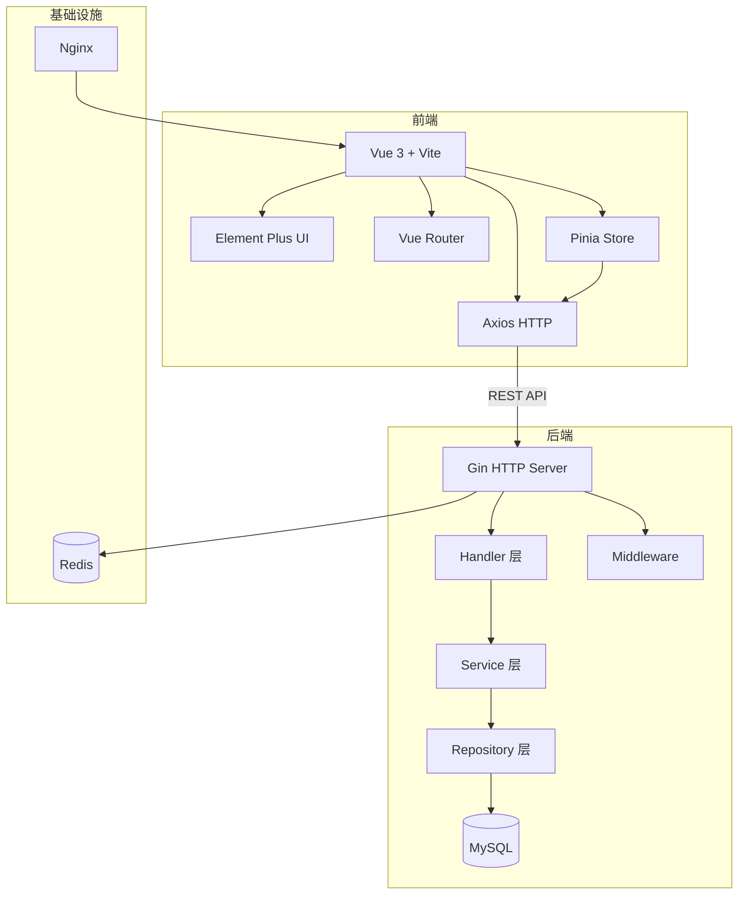
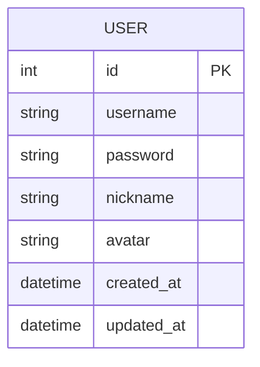
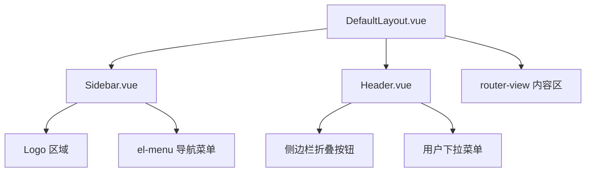

# Cybertron Portal 技术方案文档

> 最后同步: 2026-06-05

## 1. 架构总览



## 2. 后端设计

> 后端尚未实现，以下为规划结构。

### 2.1 服务入口

`backend/cmd/server/main.go` — 当前为空文件（待实现）。

### 2.2 配置管理

`backend/internal/config/` — 配置加载与解析。

### 2.3 数据模型

`backend/internal/model/` — 数据模型定义。



### 2.4 API 接口

`backend/internal/handler/` — HTTP 请求处理器。

### 2.5 业务逻辑层

`backend/internal/service/` — 业务逻辑层。

### 2.6 中间件

`backend/internal/middleware/` — 中间件（认证、日志、CORS 等）。

### 2.7 路由注册

`backend/internal/router/` — 路由注册。

## 3. 前端设计

### 3.1 路由设计

`frontend/src/router/index.ts`

| 路径 | 名称 | 组件 | 说明 |
|------|------|------|------|
| `/` | (重定向) | DefaultLayout | 重定向到 `/dashboard` |
| `/dashboard` | Dashboard | views/dashboard/Index.vue | 仪表盘 |
| `/login` | Login | views/login/Index.vue | 登录页 |
| `/:pathMatch(.*)*` | NotFound | views/error/404.vue | 404 页面 |

路由模式: `createWebHistory()`（HTML5 History 模式）

### 3.2 页面清单

| 页面 | 路径 | 功能 |
|------|------|------|
| 仪表盘 | `/dashboard` | 系统概览、欢迎页 |
| 登录页 | `/login` | 用户名/密码登录表单 |
| 404 | `*` | 页面不存在提示 |

### 3.3 布局组件



**DefaultLayout** (`frontend/src/layouts/DefaultLayout.vue`)
- 使用 Element Plus 的 `el-container` / `el-aside` / `el-header` / `el-main` 布局
- 侧边栏宽度：展开 200px，折叠 64px
- 顶栏高度：60px

**Sidebar** (`frontend/src/layouts/components/Sidebar.vue`)
- Logo 显示 "Cybertron"
- 导航菜单：`el-menu` 组件，路由模式
- 深色主题：背景 `#304156`

**Header** (`frontend/src/layouts/components/Header.vue`)
- 左侧：侧边栏折叠/展开切换按钮（Fold/Expand 图标）
- 右侧：用户头像 + 用户名下拉菜单（退出登录）

### 3.4 公共组件

`frontend/src/components/` — 当前为空，无公共组件。

### 3.5 状态管理

**useAppStore** (`frontend/src/stores/app.ts`)

| State | 类型 | 默认值 | 说明 |
|-------|------|--------|------|
| `sidebarCollapsed` | `boolean` | `false` | 侧边栏是否折叠 |
| `theme` | `'light' \| 'dark'` | `'light'` | 主题模式 |

| Action | 说明 |
|--------|------|
| `toggleSidebar()` | 切换侧边栏折叠状态 |

---

**useUserStore** (`frontend/src/stores/user.ts`)

| State | 类型 | 默认值 | 说明 |
|-------|------|--------|------|
| `token` | `string` | `''` | 认证 Token |
| `userInfo` | `UserInfo \| null` | `null` | 用户信息 |

| Getter | 返回 | 说明 |
|--------|------|------|
| `isLoggedIn` | `boolean` | 是否已登录 |
| `username` | `string` | 当前用户名 |

| Action | 说明 |
|--------|------|
| `setToken(token)` | 设置 Token |
| `setUserInfo(info)` | 设置用户信息 |
| `logout()` | 退出登录（清空 token 和 userInfo） |

```typescript
interface UserInfo {
  id: number
  username: string
  nickname: string
  avatar: string
  roles: string[]
}
```

### 3.6 API 调用层

`frontend/src/api/request.ts`

- 基于 Axios 实例封装
- `baseURL`: `import.meta.env.VITE_API_BASE_URL || '/api'`
- `timeout`: 10000ms
- 请求拦截器：自动注入 `Authorization: Bearer ${token}` 头
- 响应拦截器：统一处理 `code !== 0` 错误，弹出 ElMessage 提示

### 3.7 类型定义

`frontend/src/types/api.d.ts`

```typescript
interface ApiResponse<T = unknown> {
  code: number
  message: string
  data: T
}

interface PageResult<T> {
  list: T[]
  total: number
  page: number
  pageSize: number
}
```

## 4. 构建配置

### 4.1 Vite 配置

`frontend/vite.config.ts`

| 配置项 | 值 | 说明 |
|--------|-----|------|
| 开发服务器 | `0.0.0.0:3000` | 允许外部访问 |
| API 代理 | `/api` → `http://localhost:8080` | 开发环境代理 |
| 路径别名 | `@` → `src/` | TypeScript 路径映射 |
| 构建工具 | Vite 8.0 + Rolldown | |

### 4.2 依赖清单

| 包 | 版本 | 类别 |
|---|------|------|
| vue | ^3.5.34 | 核心框架 |
| vue-router | ^4.6.4 | 路由 |
| pinia | ^3.0.4 | 状态管理 |
| element-plus | ^2.14.1 | UI 组件库 |
| @element-plus/icons-vue | ^2.3.2 | 图标库 |
| axios | ^1.17.0 | HTTP 客户端 |
| typescript | ~6.0.2 | 类型系统 |
| vite | ^8.0.12 | 构建工具 |

## 5. 部署方案

### 5.1 服务端口

| 服务 | 端口 | 说明 |
|------|------|------|
| 前端 Dev Server | 3000 | Vite 开发服务器 |
| 后端 API | 8080 | Go Gin 服务 |
| MySQL | 3306 | 数据库 |
| Redis | 6379 | 缓存 |

### 5.2 容器编排

`deploy/` 目录规划包含：
- `Dockerfile.backend` — Go 后端镜像
- `Dockerfile.frontend` — 前端 Nginx 镜像
- `nginx/nginx.conf` — Nginx 反向代理配置

> 当前 `deploy/` 为空目录，待实现。
